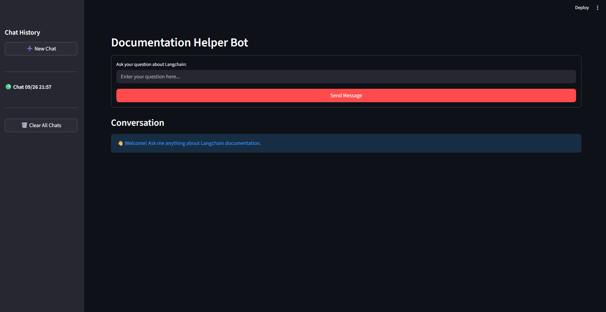

# Documentation Helper E2E

A comprehensive end-to-end documentation helper system that crawls, processes, and provides intelligent question-answering capabilities over LangChain documentation using advanced RAG (Retrieval-Augmented Generation) architecture.

## 🚀 Features

- **Intelligent Document Crawling**: Automatically crawls and extracts content from LangChain documentation
- **Advanced Text Processing**: Chunks documents using recursive character text splitting for optimal retrieval
- **Vector Storage**: Stores embeddings in Pinecone vector database for fast similarity search
- **Multi-Session Chat Interface**: Streamlit-powered web interface with chat history management
- **RAG Architecture**: Combines retrieval and generation for accurate, context-aware responses
- **History-Aware Retrieval**: Maintains conversation context for better question understanding
- **Source Attribution**: Provides source URLs for all generated responses

## 🖥️ Interface Preview


*The Documentation Helper chat interface showing multi-session conversation management, real-time responses, and source attribution*

## 🏗️ Architecture

### Core Components

1. **Ingestion Pipeline** (`ingestion.py`)
   - Crawls LangChain documentation using Tavily
   - Processes and chunks documents
   - Generates embeddings using HuggingFace multilingual model
   - Stores vectors in Pinecone

2. **Backend Core** (`Backend/core.py`)
   - Implements RAG chain with history awareness
   - Handles query processing and response generation
   - Manages retrieval and document combination

3. **Frontend Interface** (`main.py`)
   - Streamlit-based chat interface
   - Multi-session conversation management
   - Real-time response generation with source attribution

4. **Logging System** (`logger.py`)
   - Colored console output for better debugging
   - Structured logging for different operations

## 🛠️ Technology Stack

- **LangChain**: Framework for building LLM applications
- **Streamlit**: Web interface framework
- **Pinecone**: Vector database for similarity search
- **HuggingFace**: Embeddings and transformers
- **Ollama**: Local LLM integration (Gemma3)
- **Tavily**: Web crawling and content extraction
- **Python 3.12+**: Core programming language

## 📋 Prerequisites

- Python 3.12 or higher
- Pinecone API key
- Tavily API key
- Ollama installed with Gemma3 model
- UV package manager (recommended) or pip

## 🚀 Installation

1. **Clone the repository**
   ```bash
   git clone <repository-url>
   cd Documentation_helper_e2e
   ```

2. **Install dependencies**
   ```bash
   # Using UV (recommended)
   uv sync

   # Or using pip
   pip install -r requirements.txt
   ```

3. **Set up environment variables**
   Create a `.env` file in the root directory:
   ```env
   PINECONE_API_KEY=your_pinecone_api_key
   TAVILY_API_KEY=your_tavily_api_key
   PINECONE_ENVIRONMENT=your_pinecone_environment
   ```

4. **Install and configure Ollama**
   ```bash
   # Install Ollama (visit https://ollama.ai for installation instructions)
   ollama pull gemma3:latest
   ```

## 🏃‍♂️ Usage

### 1. Run the Ingestion Pipeline

First, crawl and process the documentation:

```bash
python ingestion.py
```

This will:
- Crawl LangChain documentation from `https://python.langchain.com/docs/`
- Process and chunk the documents
- Generate embeddings and store them in Pinecone
- Create searchable vector indices

### 2. Start the Chat Interface

Launch the Streamlit application:

```bash
streamlit run main.py
```

The web interface will be available at `http://localhost:8501`

### 3. Using the Chat Interface

- **New Conversations**: Click "➕ New Chat" to start a fresh conversation
- **Ask Questions**: Type your LangChain-related questions in the input field
- **View Sources**: Each response includes source URLs from the documentation
- **Chat History**: All conversations are saved and accessible via the sidebar
- **Session Management**: Switch between different chat sessions easily

## 📁 Project Structure

```
Documentation_helper_e2e/
├── Backend/
│   ├── core.py              # RAG implementation and query processing
│   └── __pycache__/
├── __pycache__/
├── ingestion.py             # Document crawling and vector storage
├── logger.py                # Colored logging utilities
├── main.py                  # Streamlit web interface
├── pyproject.toml           # Project configuration and dependencies
├── README.md                # This file
└── uv.lock                  # Lock file for UV package manager
```

## 🔧 Configuration

### Embedding Model
The system uses `intfloat/multilingual-e5-large-instruct` for generating embeddings, providing excellent multilingual support.

### Text Chunking
- **Chunk Size**: 4000 characters
- **Overlap**: 200 characters
- **Splitter**: RecursiveCharacterTextSplitter

### Vector Storage
- **Database**: Pinecone
- **Index Name**: "documentation-helper-e2e"
- **Batch Size**: 100 documents per batch

### LLM Configuration
- **Model**: Ollama Gemma3:latest
- **Temperature**: 0 (for consistent responses)
- **Context**: History-aware retrieval with conversation memory

## 🐛 Troubleshooting

### Common Issues

1. **SSL Certificate Errors**
   - The system automatically configures SSL certificates using certifi
   - Ensure your network allows HTTPS connections

2. **Pinecone Connection Issues**
   - Verify your API key and environment variables
   - Check Pinecone service status

3. **Ollama Model Not Found**
   ```bash
   ollama pull gemma3:latest
   ```

4. **Memory Issues During Ingestion**
   - Reduce batch size in `index_documents_async()` function
   - Monitor system memory usage

### Logs and Debugging

The application provides colored logging output:
- 🟢 **Success**: Operations completed successfully
- 🔵 **Info**: General information and progress updates
- 🟡 **Warning**: Non-critical issues
- 🔴 **Error**: Critical errors that need attention


## 🙏 Acknowledgments

- LangChain team for the comprehensive documentation and framework
- Streamlit for the excellent web interface framework
- HuggingFace for the embedding models
- Pinecone for vector storage capabilities
- Tavily for web crawling functionality
